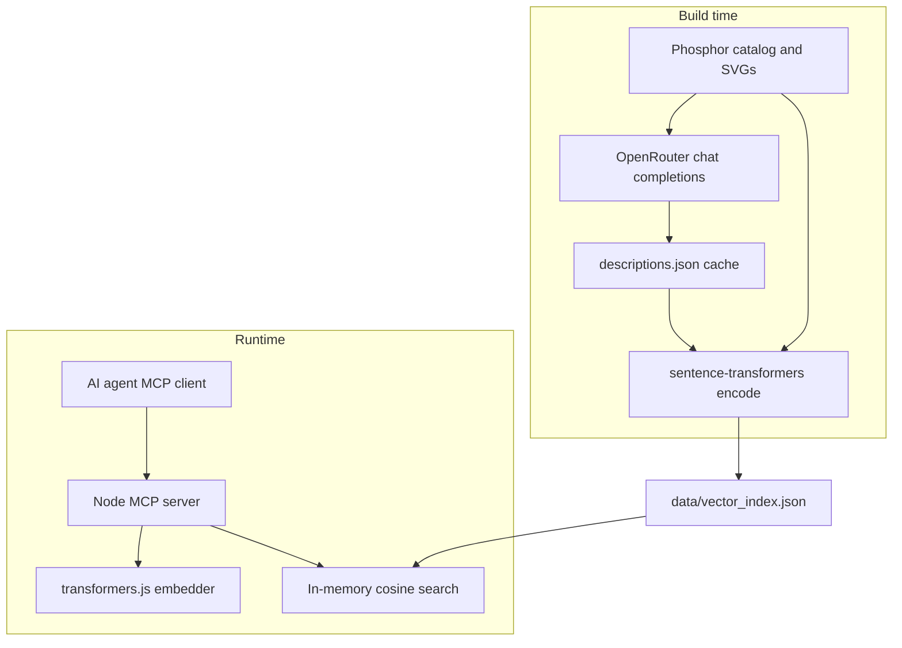
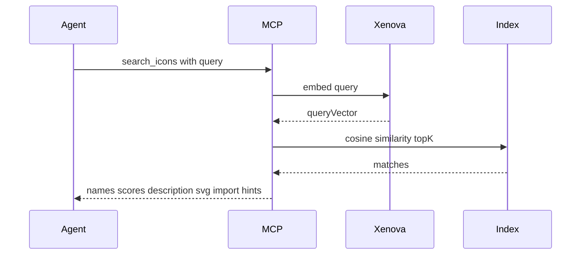
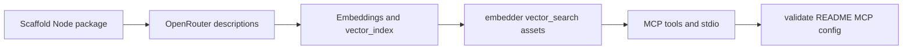

# Phosphor Icons Semantic MCP — Implementation Plan

## Current state

The repo contains only [`idea.md`](idea.md). No `package.json`, build scripts, or MCP server yet. Target layout matches the idea doc with one naming tweak: use repo name `phosphor-icons-semantic-search-mcp` for the npm package.

## Decisions (confirmed / recommended)

| Topic | Choice |
|-------|--------|
| LLM (build) | **OpenRouter** chat completions — mirror [`cook_book/packages/openrouter_api`](file:///Users/paul/Git/cook_book/packages/openrouter_api) (`POST https://openrouter.ai/api/v1/chat/completions`, `Authorization: Bearer`, optional `HTTP-Referer` / `X-OpenRouter-Title`) |
| Index distribution | **Commit** [`data/vector_index.json`](data/vector_index.json) after build |
| Catalog source | **`@phosphor-icons/core`** (~1,512 unique icon names, 6 weights; index **one row per icon name**) |
| Default SVG in index | **`regular`** weight only (~1.5MB SVG total); other weights resolved at runtime from `@phosphor-icons/core` |
| Embeddings | Build: `sentence-transformers/all-MiniLM-L6-v2` with `normalize_embeddings=True`; Runtime: `Xenova/all-MiniLM-L6-v2` with `{ pooling: 'mean', normalize: true, dtype: 'fp32' }` |
| MCP SDK | **`@modelcontextprotocol/server`** (current TS SDK; idea’s `@modelcontextprotocol/sdk` is outdated) |
| Build LLM model | **`google/gemini-2.5-flash-lite`** (confirmed) |

## Architecture





## Project structure

```
phosphor-icons-semantic-search-mcp/
├── build/
│   ├── lib/
│   │   └── openrouter_client.py      # thin httpx client (cook_book parity)
│   ├── 01_generate_descriptions.py
│   ├── 02_create_embeddings.py
│   └── 03_validate_index.ts          # optional parity smoke test
├── build/cache/                      # gitignored except committed index
│   └── descriptions.json
├── data/
│   └── vector_index.json             # committed artifact
├── src/
│   ├── index.ts                      # MCP entry + stdio
│   ├── embedder.ts
│   ├── vector_search.ts
│   ├── icon_assets.ts                # load SVG by weight from @phosphor-icons/core
│   └── types.ts
├── package.json
├── tsconfig.json
├── requirements.txt
├── .env.example
└── README.md
```

## Phase 1 — Node / TypeScript scaffold

**[`package.json`](package.json)**

- `name`: `phosphor-icons-semantic-search-mcp`
- `type`: `module`, `bin`: `{ "phosphor-icon-search": "./dist/index.js" }`
- Dependencies: `@modelcontextprotocol/server`, `zod`, `@xenova/transformers`, `@phosphor-icons/core` (runtime SVG lookup for non-regular weights)
- Dev: `typescript`, `tsx`, `@types/node`
- Scripts: `build`, `start`, `prepare` (build on install optional — prefer explicit `npm run build`)

**[`tsconfig.json`](tsconfig.json)**

- `outDir: dist`, `rootDir: src`, `resolveJsonModule: true` for loading index
- Consider **splitting index**: ship `vector_index.min.json` with `{ name, description, vector }` only, and load SVGs from disk on demand to keep git lean — **only if** committed index exceeds ~15–20MB after first build. Initial implementation can follow idea.md (SVG inline); optimize if size is painful.

**Types** ([`src/types.ts`](src/types.ts)):

```ts
interface IconIndexEntry {
  name: string;
  description: string;
  vector: number[]; // length 384
  svg: string;      // regular weight
}
```

## Phase 2 — Build: OpenRouter descriptions

**[`build/lib/openrouter_client.py`](build/lib/openrouter_client.py)** — port the essentials from cook_book:

- `POST {base}/chat/completions` with JSON body
- Headers: `Authorization: Bearer {OPENROUTER_API_KEY}`, `Content-Type: application/json`, `X-OpenRouter-Title: phosphor-icons-semantic-search-mcp`
- Parse `choices[0].message.content`; support `response_format: { type: "json_object" }`
- Map API errors from `error.message` like [`OpenRouterClient._mapDioException`](file:///Users/paul/Git/cook_book/packages/openrouter_api/lib/src/openrouter_api_client.dart)

**Env** (`.env.example`):

- `OPENROUTER_API_KEY` (required for build)
- `OPENROUTER_MODEL=google/gemini-2.5-flash-lite` (confirmed; override only for experiments)
- `OPENROUTER_BATCH_SIZE` default `20`

**Build LLM:** `google/gemini-2.5-flash-lite` via OpenRouter — batched `response_format: { type: "json_object" }` for hybrid descriptions. Cache key in `descriptions.json` metadata should include this model id so a future model change does not silently reuse stale descriptions.

**[`build/01_generate_descriptions.py`](build/01_generate_descriptions.py)**

1. Read catalog from `node_modules/@phosphor-icons/core` (run `npm install` first) — parse `dist/index.mjs` export `icons` **or** import catalog via a tiny Node helper that writes `build/cache/catalog.json` (simplest reliability).
2. For each `IconEntry`, load `assets/regular/{name}-regular.svg`.
3. **Resume-safe**: write `build/cache/descriptions.json` incrementally; skip icons already present.
4. **Batch prompt** (N icons per request) asking for JSON array:

   - Fields per icon: `name`, `description` (single string with sections: Visual / Concept / UI-UX Use Cases — exactly what gets embedded later).
   - Seed context from Phosphor `tags` and `categories` in the prompt to reduce hallucination and cost.
   - Include **inline SVG text** in the prompt (most icons &lt;2KB); no vision API required for v1.

5. Rate-limit / retry with exponential backoff on 429/5xx.
6. Validate response schema before merge.

**Output**: `build/cache/descriptions.json` — `{ "gear-six": { "name", "description", "svg" }, ... }`

## Phase 3 — Build: embeddings + committed index

**[`build/02_create_embeddings.py`](build/02_create_embeddings.py)**

1. Load `descriptions.json`.
2. `SentenceTransformer("sentence-transformers/all-MiniLM-L6-v2")`.
3. For each icon: `model.encode(description, normalize_embeddings=True)` → list of 384 floats.
4. Write [`data/vector_index.json`](data/vector_index.json) as JSON array (pretty-print for review; optional `npm run build:index:min` later for production).

**[`build/03_validate_index.ts`](build/03_validate_index.ts)** (CI-worthy):

- Load index; pick 5–10 fixed queries (e.g. `"settings menu"`, `"logout"`, `"delete trash"`).
- Embed queries with runtime [`src/embedder.ts`](src/embedder.ts).
- Assert top-3 results are reasonable and that re-embedding a stored `description` yields cosine similarity **≥ 0.99** with its stored vector (catches Python/JS drift).
- Fail build if below threshold; document fix: use `dtype: 'fp32'` and WASM (not WebGPU) in embedder.

## Phase 4 — Runtime modules

**[`src/embedder.ts`](src/embedder.ts)**

- Lazy singleton `pipeline('feature-extraction', 'Xenova/all-MiniLM-L6-v2', { dtype: 'fp32' })`.
- `getEmbedding(text)` → `number[]` via `pooling: 'mean', normalize: true` and `Array.from(output.data)` (or `.tolist()` for batch).
- Log first-run model download to **stderr** (stdio MCP must not pollute stdout).

**[`src/vector_search.ts`](src/vector_search.ts)**

- Load index once at startup (parse JSON from package-relative path via `import.meta.url` / `fileURLToPath`).
- `cosineSimilarity` = dot product (vectors L2-normalized).
- `searchIcons(queryVector, topK)` → sorted matches **without** returning full vectors to the tool response (strip `vector` from output).

**[`src/icon_assets.ts`](src/icon_assets.ts)**

- `getIconSvg(name, weight = 'regular')`: return indexed SVG for `regular`; else `readFile` from `@phosphor-icons/core/assets/{weight}/{name}-{weight}.svg`.
- `getImportHints(name)`: e.g. React `import { GearSix } from '@phosphor-icons/react'` using `pascal_name` from catalog (load catalog once or embed `pascal_name` in index at build time — **recommended**: add `pascalName` field during build to avoid runtime catalog parse).

## Phase 5 — MCP server + tools

**[`src/index.ts`](src/index.ts)**

```ts
const server = new McpServer(
  { name: 'phosphor-icons-semantic-search', version: '0.1.0' },
  { instructions: 'Use search_icons for intent-based lookup. Prefer regular weight unless user specifies bold/fill/duotone.' }
);
```

**Tool 1: `search_icons`** (primary)

| Param | Type | Notes |
|-------|------|-------|
| `query` | string | Natural language intent |
| `limit` | number optional | default 5, max 20 |
| `weight` | enum optional | `thin` \| `light` \| `regular` \| `bold` \| `fill` \| `duotone` |

Returns JSON text content per match:

- `name`, `score`, `description` (truncated if long)
- `svg` for requested weight
- `react`: `import { X } from '@phosphor-icons/react'` + `<X weight="..." />`
- `categories`, `tags` if stored in index

**Tool 2: `get_icon`** (exact lookup by kebab-case name)

- Same output shape; no embedding; useful when agent already knows the name.

**Transport**: `StdioServerTransport`; `main()` catches errors and logs to stderr.

**Cursor config snippet** in README:

```json
{
  "mcpServers": {
    "phosphor-icons": {
      "command": "npx",
      "args": ["-y", "phosphor-icons-semantic-search-mcp"]
    }
  }
}
```

## Phase 6 — Developer workflow & docs

**Root scripts**

| Script | Action |
|--------|--------|
| `npm run build:data` | `python -m build.01...` + `python -m build.02...` |
| `npm run validate:index` | `tsx build/03_validate_index.ts` |
| `npm run build` | `tsc` |
| `npm start` | `node dist/index.js` |

**[`requirements.txt`](requirements.txt)**: `sentence-transformers`, `httpx`, `python-dotenv`, `tqdm`

**[`README.md`](README.md)** (user asked only for plan — implement README in execution phase):

- Mermaid: build vs runtime (from idea.md)
- One-time: `OPENROUTER_API_KEY`, `npm install`, `pip install -r requirements.txt`, `npm run build:data`
- MCP install for Cursor
- Note: first MCP query may take ~10–30s while Xenova downloads ~22MB model

**`.gitignore`**: `build/cache/`, `.env`, `node_modules/`, `dist/`, model cache `~/.cache/huggingface/` note in README

## Phase 7 — Quality checks (manual + automated)

**Golden queries** (document expected top icon in README or `build/fixtures/golden_queries.json`):

- `"settings menu"` → `gear`, `gear-six`, or `sliders`
- `"sign out account"` → `sign-out`
- `"warning alert"` → `warning`, `warning-circle`

**Manual MCP test**: run server, invoke `search_icons` from Cursor MCP inspector.

**License**: MIT; Phosphor assets MIT via `@phosphor-icons/core`.

## Risks and mitigations

1. **Embedding mismatch (Python build vs JS runtime)** — `03_validate_index.ts` gate; fp32 + normalized vectors on both sides.
2. **OpenRouter cost** (~1,512 icons, batched 20 → ~76 calls) — cache `descriptions.json`; rerunnable script.
3. **Large git artifact** — monitor `vector_index.json` size; fallback: store vectors + descriptions only, fetch SVGs at runtime.
4. **Duotone SVG complexity** — document that duotone may need two-layer handling in React (`weight="duotone"` prop) vs raw SVG.

## Implementation order

Execute phases **1 → 2 → 3 → 4 → 5 → 6 → 7** sequentially; do not commit an empty `vector_index.json` — run full build once before first publish.


