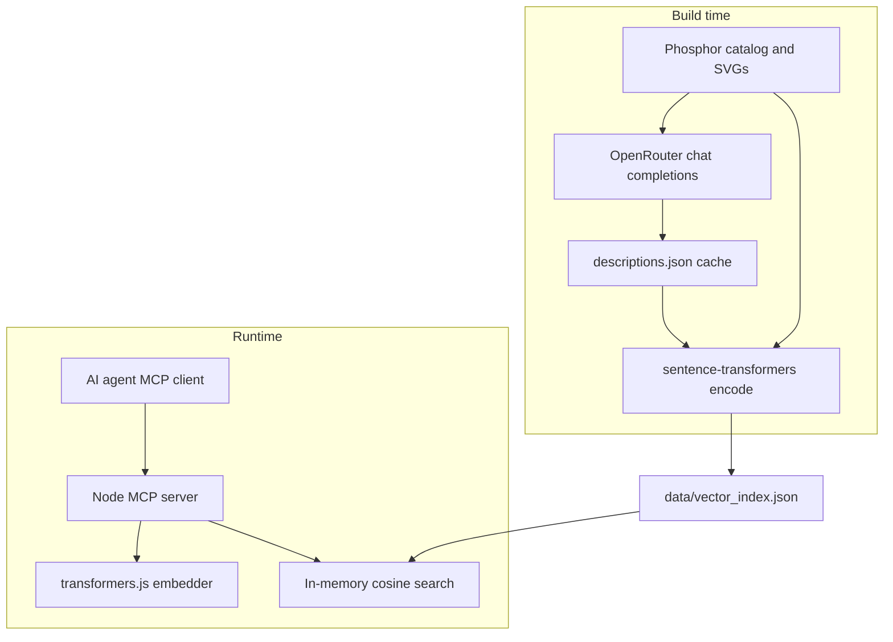

[](https://mseep.ai/app/inf0rmatix-phosphor-icons-semantic-search-mcp)

# Phosphor Icons Semantic Search MCP

MCP server for finding [Phosphor](https://phosphoricons.com) icons by what you mean (settings, logout, delete, and so on), not only by exact name.

Not an official Phosphor project. See [License](#license) for icon attribution.



## Tools

| Tool | Purpose |
| --- | --- |
| `search_icons` | Semantic search (`query`, optional `limit`, `weight`) |
| `get_icon` | Lookup by kebab-case name (e.g. `gear-six`) |

Results include `name`, `score`, `description`, `svg`, plus copy-paste hints for React (`@phosphor-icons/react`) and Flutter (`phosphor_flutter`).

## Quick start

Cursor or Claude Desktop:

```json
{
  "mcpServers": {
    "phosphor-icons": {
      "command": "npx",
      "args": ["-y", "phosphor-icons-semantic-search-mcp"]
    }
  }
}
```

From a clone (after `npm install` and `npm run build`):

```json
{
  "mcpServers": {
    "phosphor-icons": {
      "command": "node",
      "args": ["/absolute/path/to/phosphor-icons-semantic-search-mcp/dist/index.js"]
    }
  }
}
```

The first search can take 10–30 seconds while the local embedding model (~22MB) downloads.

## Rebuild the index

For maintainers who want to regenerate `data/vector_index.json`.

### Prerequisites

- Node.js 20+
- Python 3.10+ (venv)
- [Cairo](https://cairographics.org/) for SVG → PNG in vision prompts (`brew install cairo` on macOS)

```bash
npm install
python3 -m venv .venv
.venv/bin/pip install -r requirements.txt
cp .env.example .env   # set OPENROUTER_API_KEY
```

### Pipeline

Descriptions use OpenRouter vision (`google/gemini-2.5-flash-lite` by default): one icon per HTTP request, several requests in parallel.

```bash
npm run build:full
```

Or step by step:

```bash
npm run export-catalog
npm run build:descriptions   # ~1512 icons, OPENROUTER_CONCURRENCY parallel workers
npm run build:embeddings
npm run validate:index
```

Cache version **11**: one icon per vision call, optional [Gemini prompt caching](https://openrouter.ai/docs/guides/best-practices/prompt-caching) on OpenRouter. Entries already at the current version are skipped. Delete `build/cache/descriptions.json` to rebuild everything after prompt changes.

Embeddings use a `passage:` prefix at index time (UI role, search terms, optional "Does not match", tags) and a `query:` prefix at search time. The long Visual/Concept blocks in descriptions are for agents reading results, not for the embedder.

Runtime search is cosine similarity only. No hand-tuned reranking.

Without an API key you can still run the pipeline with stub text:

```bash
USE_OFFLINE_DESCRIPTIONS=1 npm run build:descriptions
```

That uses catalog tags and categories. Vision descriptions work much better for real queries.

Quick check after changing prompts or models:

```bash
npm run smoke:descriptions
```

Single icon, one API call, prints the generated description.

### Environment variables

Used by `build:descriptions` and `smoke:descriptions` (load `.env` via python-dotenv). The MCP server at runtime does not read these.

For flags that default to on, set `0`, `false`, or `no` to disable.

| Variable | Default | Description |
| --- | --- | --- |
| `OPENROUTER_API_KEY` | — | OpenRouter API key. Required unless `USE_OFFLINE_DESCRIPTIONS=1` |
| `OPENROUTER_BASE_URL` | `https://openrouter.ai/api/v1` | OpenRouter API base URL |
| `OPENROUTER_MODEL` | `google/gemini-2.5-flash-lite` | Chat model for vision descriptions |
| `OPENROUTER_BATCH_SIZE` | `1` | Icons per HTTP request (`build_vision_messages` expects `1`) |
| `OPENROUTER_CONCURRENCY` | `8` | Parallel description workers |
| `OPENROUTER_PROMPT_CACHING` | `1` | Add `cache_control` on static prompt blocks ([Gemini caching](https://openrouter.ai/docs/guides/best-practices/prompt-caching)) |
| `OPENROUTER_TIMEOUT_SECONDS` | `120` | `httpx` timeout per request (seconds). `.env.example` sets `180` |
| `OPENROUTER_MAX_TOKENS` | `1800 × OPENROUTER_BATCH_SIZE` | If unset. If set, used as the completion cap (minimum 256) |
| `OPENROUTER_STRUCTURED_OUTPUT` | `1` | If off, no `response_format` is sent |
| `OPENROUTER_JSON_SCHEMA` | `1` | If on and structured output is on: strict JSON schema; otherwise `json_object` |
| `OPENROUTER_RESPONSE_HEALING` | `1` | OpenRouter [Response Healing](https://openrouter.ai/docs/guides/features/plugins/response-healing) plugin |
| `ICON_RENDER_SIZE` | `512` | PNG edge length for vision prompts |
| `USE_OFFLINE_DESCRIPTIONS` | off | Set `1`, `true`, or `yes` to skip the LLM and use catalog tags only |

`npm run validate:index` only:

| Variable | Default | Description |
| --- | --- | --- |
| `EMBEDDING_PARITY_THRESHOLD` | `0.99` | Min cosine similarity between Python-built and JS re-embed samples |

## Development

```bash
npm run build              # TypeScript → dist/
npm start                  # MCP on stdio
npm run smoke:descriptions # one vision call (needs .env)
npm run build:full         # compile + data pipeline + validate:index
npm run build:data         # catalog → descriptions → embeddings
npm run validate:index     # index parity + golden queries
```

## Golden queries

`npm run validate:index` runs intents from `build/fixtures/golden_queries.json` (settings, sign-in/out, delete, search, filter, add, complete, profile vs account settings, upload, notifications, and others). Each query must hit an expected icon in the top 5.

## License

This repo's code is [MIT](LICENSE).

Icon SVGs, names, tags, and categories are from [Phosphor Icons](https://github.com/phosphor-icons) ([`@phosphor-icons/core`](https://github.com/phosphor-icons/core)), also MIT. They appear in `data/vector_index.json` and in MCP responses. Full third-party notice: [NOTICE](NOTICE).

Semantic descriptions in the index are generated at build time and are not part of Phosphor's copyright on the glyphs.

"Phosphor" is their trademark. This package is a community search helper, not an official port. Brand-style icons (social logos, etc.) may have extra rules when you ship them in an app; that is on you, not covered here.
