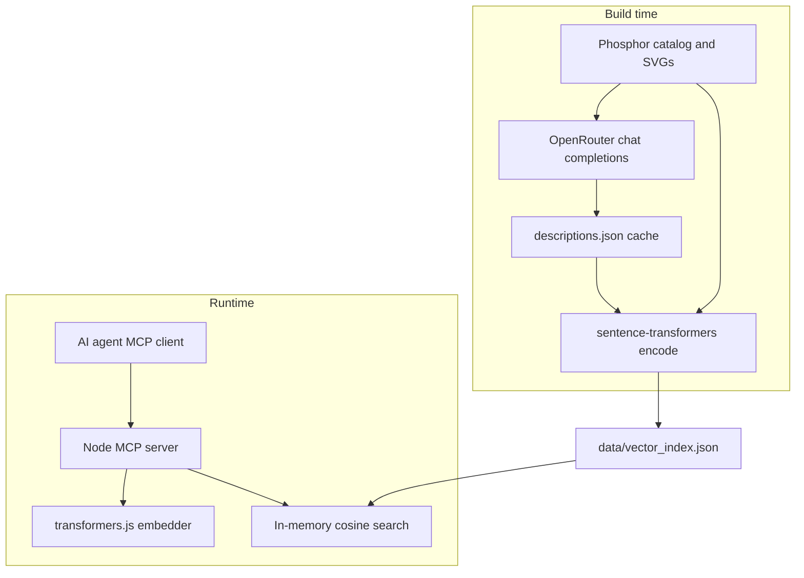

# Phosphor Icons Semantic Search MCP

Local MCP server that finds [Phosphor](https://phosphoricons.com) icons by meaning — visual appearance, concepts, and UI intent — not just exact names.



## Tools

| Tool | Purpose |
|------|---------|
| `search_icons` | Semantic search by natural language (`query`, optional `limit`, `weight`) |
| `get_icon` | Exact lookup by kebab-case name |

Each result includes `name`, `score`, `description`, `svg`, and React import/JSX hints.

## Quick start (MCP client)

Add to Cursor or Claude Desktop MCP config:

```json
{
  "mcpServers": {
    "phosphor-icons": {
      "command": "npx",
      "args": ["-y", "phosphor-icons-semantic-search-mcp"]
    }
  }
}
```

Or run locally after cloning:

```json
{
  "mcpServers": {
    "phosphor-icons": {
      "command": "node",
      "args": ["/absolute/path/to/phosphor-icons-semantic-search-mcp/dist/index.js"]
    }
  }
}
```

The first search may take 10–30 seconds while the embedding model (~22MB) downloads and caches.

## Rebuild the index (maintainers)

### Prerequisites

- Node.js 20+
- Python 3.10+ with venv
- [Cairo](https://cairographics.org/) for SVG rasterization (e.g. `brew install cairo` on macOS)

```bash
npm install
python3 -m venv .venv
.venv/bin/pip install -r requirements.txt
cp .env.example .env   # add OPENROUTER_API_KEY
```

### Generate descriptions (OpenRouter)

Uses `google/gemini-2.5-flash-lite` with **vision** (rendered PNGs, not inline SVG). Batches run in parallel (`OPENROUTER_CONCURRENCY`):

```bash
npm run build:full
```

Or step by step:

```bash
npm run export-catalog
npm run build:descriptions   # 1 icon per request, 8 parallel workers (~1512 requests)
npm run build:embeddings
npm run validate:index
```

Description cache version **11** uses one icon per vision request with optional Gemini prompt caching on OpenRouter. Stale cache entries are skipped automatically; delete `build/cache/descriptions.json` to force a full refresh after prompt changes.

**Embeddings:** index entries use `passage:` text (UI role, search terms, optional "Does not match", tags); queries use `query:` prefix. Visual/Concept stay in agent-facing descriptions only.

Search is **pure vector similarity** — quality comes from prompts + embed structure at build time.

For local testing without an API key:

```bash
USE_OFFLINE_DESCRIPTIONS=1 npm run build:descriptions
```

Offline descriptions use catalog tags/categories only; vision LLM descriptions produce much better semantic search quality.

Set `OPENROUTER_API_KEY` in `.env` (see `.env.example`). Descriptions use **OpenRouter** with **`google/gemini-2.5-flash-lite`** by default.

### Environment variables

| Variable | Default | Description |
|----------|---------|-------------|
| `OPENROUTER_API_KEY` | — | OpenRouter API key |
| `OPENROUTER_MODEL` | `google/gemini-2.5-flash-lite` | OpenRouter model (vision) |
| `OPENROUTER_BATCH_SIZE` | `1` | Icons per request (use `1` for reliability + prompt cache) |
| `OPENROUTER_CONCURRENCY` | `8` | Parallel requests |
| `OPENROUTER_PROMPT_CACHING` | `1` | `cache_control` on static prompt blocks ([Gemini caching](https://openrouter.ai/docs/guides/best-practices/prompt-caching)) |
| `OPENROUTER_TIMEOUT_SECONDS` | `120` | HTTP timeout per request |
| `OPENROUTER_MAX_TOKENS` | `1800 × batch size` | Cap completion tokens (truncation is not repairable) |
| `OPENROUTER_STRUCTURED_OUTPUT` | `1` | Set `0` to omit `response_format` |
| `OPENROUTER_JSON_SCHEMA` | `1` | Strict schema via [OpenRouter structured outputs](https://openrouter.ai/docs/guides/features/structured-outputs) |
| `OPENROUTER_RESPONSE_HEALING` | `1` | [Response Healing](https://openrouter.ai/docs/guides/features/plugins/response-healing) plugin for malformed JSON |
| `ICON_RENDER_SIZE` | `512` | PNG size for vision prompts |
| `USE_OFFLINE_DESCRIPTIONS` | — | Set to `1` to skip the LLM |

## Development

```bash
npm run build          # compile TypeScript
npm start              # run MCP server on stdio
npm run build:full     # build + data pipeline + validate:index
npm run build:data     # catalog → descriptions → embeddings only
npm run validate:index # parity + golden query checks
```

## Golden queries

`npm run validate:index` checks diverse UI intents (see `build/fixtures/golden_queries.json`), for example:

- Settings, auth (sign-in / sign-out), warnings, delete, search, filter
- Generic add (`plus`), add-to-list, mark complete
- Profile vs account settings vs switch user
- Upload, download, edit, share, notifications, home, close, copy
- Expand/collapse, cart, calendar, browse folders, help

Each query expects a matching icon in the top 5 — not tied to one app domain.

## License

MIT. Phosphor icon assets are MIT via [`@phosphor-icons/core`](https://github.com/phosphor-icons/core).
