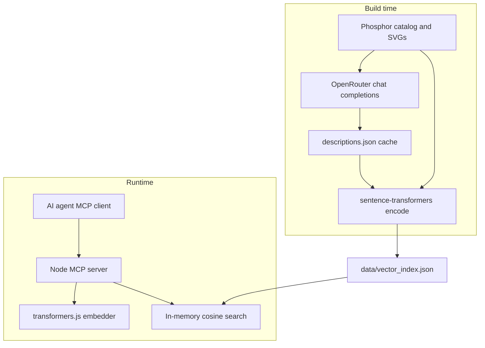

# Phosphor Icons Semantic Search MCP

Local MCP server that finds [Phosphor](https://phosphoricons.com) icons by meaning — visual appearance, concepts, and UI intent — not just exact names.



## Tools

| Tool | Purpose |
|------|---------|
| `search_icons` | Semantic search by natural language (`query`, optional `limit`, `weight`) |
| `get_icon` | Exact lookup by kebab-case name |

Each result includes `name`, `score`, `description`, `svg`, and React import/JSX hints.

## Quick start (MCP client)

Add to Cursor or Claude Desktop MCP config:

```json
{
  "mcpServers": {
    "phosphor-icons": {
      "command": "npx",
      "args": ["-y", "phosphor-icons-semantic-search-mcp"]
    }
  }
}
```

Or run locally after cloning:

```json
{
  "mcpServers": {
    "phosphor-icons": {
      "command": "node",
      "args": ["/absolute/path/to/phosphor-icons-semantic-search-mcp/dist/index.js"]
    }
  }
}
```

The first search may take 10–30 seconds while the embedding model (~22MB) downloads and caches.

## Rebuild the index (maintainers)

### Prerequisites

- Node.js 20+
- Python 3.10+ with venv
- [Cairo](https://cairographics.org/) for SVG rasterization (e.g. `brew install cairo` on macOS)

```bash
npm install
python3 -m venv .venv
.venv/bin/pip install -r requirements.txt
cp .env.example .env   # add OPENROUTER_API_KEY
```

### Generate descriptions (OpenRouter)

Uses `google/gemini-2.5-flash-lite` with **vision** (rendered PNGs, not inline SVG). Batches run in parallel (`OPENROUTER_CONCURRENCY`):

```bash
npm run build:full
```

Or step by step:

```bash
npm run export-catalog
npm run build:descriptions   # ~189 batches of 8 icons, 4 parallel workers
npm run build:embeddings
npm run validate:index
```

Description cache version **7** uses retrieval-focused prompts (full query phrases, batch contrast, `Avoid matching`). Stale cache entries are skipped automatically; delete `build/cache/descriptions.json` to force a full refresh after prompt changes.

**Embeddings:** index entries use `passage:` text (UI role + search terms + tags only); queries use `query:` prefix. Visual/Concept stay in descriptions returned to agents but are not embedded.

Search is **pure vector similarity** — quality comes from prompts + embed structure at build time.

For local testing without an API key:

```bash
USE_OFFLINE_DESCRIPTIONS=1 npm run build:descriptions
```

Offline descriptions use catalog tags/categories only; OpenRouter produces much better semantic search quality.

### Environment variables

| Variable | Default | Description |
|----------|---------|-------------|
| `OPENROUTER_API_KEY` | — | Required for LLM descriptions |
| `OPENROUTER_MODEL` | `google/gemini-2.5-flash-lite` | OpenRouter model slug (vision-capable) |
| `OPENROUTER_BATCH_SIZE` | `8` | Icons per API request |
| `OPENROUTER_CONCURRENCY` | `4` | Parallel batch requests |
| `ICON_RENDER_SIZE` | `128` | PNG size for vision prompts |
| `USE_OFFLINE_DESCRIPTIONS` | — | Set to `1` to skip OpenRouter |

## Development

```bash
npm run build          # compile TypeScript
npm start              # run MCP server on stdio
npm run build:full     # build + data pipeline + validate:index
npm run build:data     # catalog → descriptions → embeddings only
npm run validate:index # parity + golden query checks
```

## Golden queries

Validation checks these intents (see `build/fixtures/golden_queries.json`):

- `"settings menu configuration"` → `gear-six`, `gear`, `sliders`, …
- `"sign out of account logout"` → `sign-out`
- `"warning alert danger"` → `warning`, `warning-circle`, …
- `"delete trash remove"` → `trash`, `trash-simple`
- `"search find magnifying glass"` → `magnifying-glass`, …

## License

MIT. Phosphor icon assets are MIT via [`@phosphor-icons/core`](https://github.com/phosphor-icons/core).
