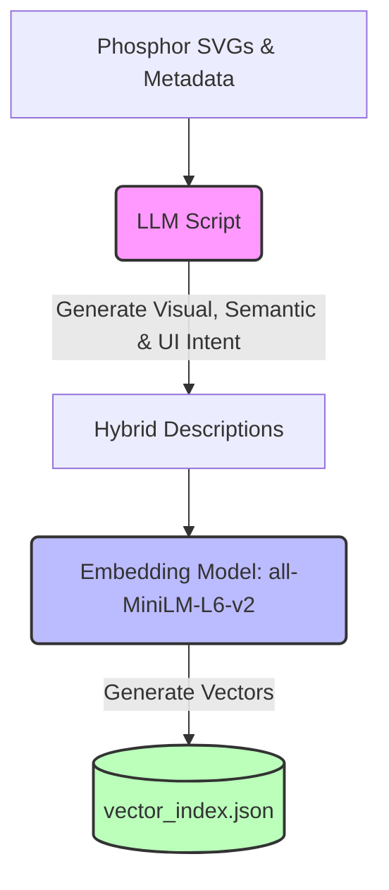
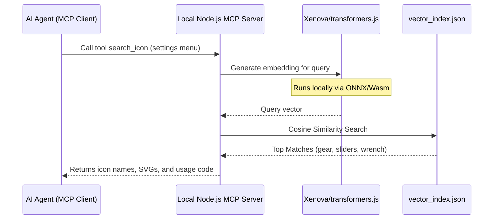

# 🔍 Phosphor Icons Semantic MCP Server

A local, lightning-fast Model Context Protocol (MCP) server that enables AI agents to find Phosphor icons via semantic descriptions, visual characteristics, and UI/UX intent.

## 🛠 Tech Stack

### Build Time (Offline / Prep)

* **Data Source:** `phosphor-icons` repository (SVGs + basic metadata).

* **Describer:** Cloud LLM (Gemini 1.5 Pro or GPT-4o) prompted to generate hybrid descriptions covering **visuals, concepts, and use cases**. (e.g., *"Visual: magnifying glass. Concept: search, find, inspect. Use case: search bars, zooming."*).

* **Embedder:** `sentence-transformers` (Python) using a lightweight model like `all-MiniLM-L6-v2`.

* **Storage:** A static `vector_index.json` file.

### Runtime (Local MCP Server)

* **Runtime Environment:** Node.js (highly portable for MCP).

* **Local Embedder:** `@xenova/transformers.js` (Runs the exact same `all-MiniLM-L6-v2` model locally via WebAssembly, 0 native dependencies).

* **Vector DB:** In-memory Array + Cosine Similarity math. (For \~1,000 to 2,000 icons, an O(N) array search takes less than 5ms locally—no need for heavy databases like Chroma or Milvus).

* **Server Framework:** `@modelcontextprotocol/sdk` (TypeScript).

## 🏗 Architecture Diagrams

### 1. Build-Time Pipeline (Run Once)

This process happens on the developer's machine before shipping the tool. The crucial step here is prompting the LLM to think like a UI/UX designer.



### 2. Runtime MCP Server (Local)

This is what the AI Agent (e.g., Claude Desktop, Cursor) interacts with. It can now search by intent.



## 📂 Project Structure

```
phosphor-semantic-mcp/
├── build/
│   ├── 01_generate_descriptions.py # Uses LLM to write hybrid visual/semantic descriptions
│   └── 02_create_embeddings.py     # Uses SentenceTransformers to make vector_index.json
├── src/
│   ├── index.ts                    # MCP Server entry point
│   ├── embedder.ts                 # Xenova transformers.js wrapper
│   └── vector_search.ts            # Math for Cosine Similarity
├── data/
│   └── vector_index.json           # Shipped with the package [id, name, vector, svg]
├── package.json
└── tsconfig.json

```

## 💻 Code Highlights

### The Data Format (`vector_index.json`)

By combining the visual and the semantic into a single descriptive string before embedding it, the resulting vector captures both *what it looks like* and *what it's used for*.

```
[
  {
    "name": "gear-six",
    "description": "Visual: A circular cog or gear with six protruding teeth. Concept: mechanical, engine, machine. UI/UX Use Cases: settings menu, configuration, user preferences, options, admin panel.",
    "vector": [0.012, -0.045, 0.112, ...], 
    "svg": "<svg>...</svg>"
  },
  {
    "name": "sign-out",
    "description": "Visual: A bracket shaped like a door with an arrow pointing out to the right. Concept: leave, exit, escape. UI/UX Use Cases: log out, sign out of account, disconnect, leave page.",
    "vector": [-0.022, 0.145, -0.012, ...], 
    "svg": "<svg>...</svg>"
  }
]

```

### The Local Embedder (`embedder.ts`)

Using Xenova ensures we don't need Python or Docker running on the user's machine. It downloads the \~22MB model on first run and caches it locally.

```
import { pipeline } from '@xenova/transformers';

let extractor: any = null;

export async function getEmbedding(text: string): Promise<number[]> {
    if (!extractor) {
        // Loads a tiny, fast model locally via WebAssembly
        extractor = await pipeline('feature-extraction', 'Xenova/all-MiniLM-L6-v2');
    }
    const output = await extractor(text, { pooling: 'mean', normalize: true });
    return Array.from(output.data);
}

```

### The In-Memory Vector Search (`vector_search.ts`)

No need for a bulky Vector DB. A simple dot-product loop is instantaneous for thousands of items.

```
import db from '../data/vector_index.json';

// Standard Cosine Similarity math
function cosineSimilarity(vecA: number[], vecB: number[]) {
    let dotProduct = 0;
    for (let i = 0; i < vecA.length; i++) dotProduct += vecA[i] * vecB[i];
    return dotProduct; // Assuming vectors are already normalized
}

export function searchIcons(queryVector: number[], topK = 5) {
    const scored = db.map(icon => ({
        ...icon,
        score: cosineSimilarity(queryVector, icon.vector)
    }));
    
    return scored.sort((a, b) => b.score - a.score).slice(0, topK);
}

```

## 🚀 Why this setup is optimal

1. **Intent-Driven:** Coding agents can search for *concepts* (e.g., "auth screen") instead of struggling to guess icon names.

2. **Zero Runtime Cost:** No API calls required during use.

3. **Easy Installation:** `npx` or a simple global `npm install` handles everything. No Python environments to debug for the end-user.

4. **Agent-Friendly Output:** The MCP server can directly return the raw `<svg>` string and the JSX/React import string so the coding agent can immediately paste it into the user's codebase.
